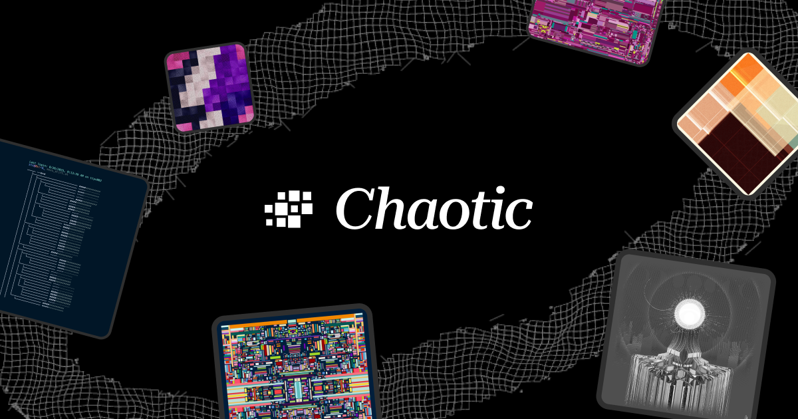

# Chaotic — Press Kit

Official Chaotic brand assets for press, partners, and community.

## Assets

* `chaotic_black.svg` / `chaotic_black.png` — Wordmark for light backgrounds
* `chaotic_white.svg` / `chaotic_white.png` — Wordmark for dark backgrounds
* `chaotic_symbol_black.svg` / `chaotic_symbol_black.png` — Symbol for light backgrounds
* `chaotic_symbol_white.svg` / `chaotic_symbol_white.png` — Symbol for dark backgrounds
  *Prefer SVG; PNGs are for quick use or non-vector tools.*

## Usage

* Monochrome only (black or white), with strong contrast.
* Don’t alter the marks (no recolors, effects, stretching, or outlines).

## Accessibility

* Wordmark `alt="Chaotic logo"`
* Symbol `alt="Chaotic symbol"`

## Colors

* Black `#000000` · White `#FFFFFF`

